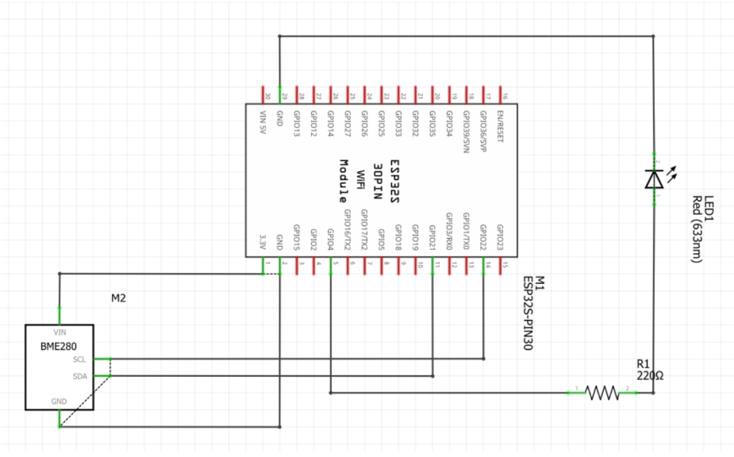
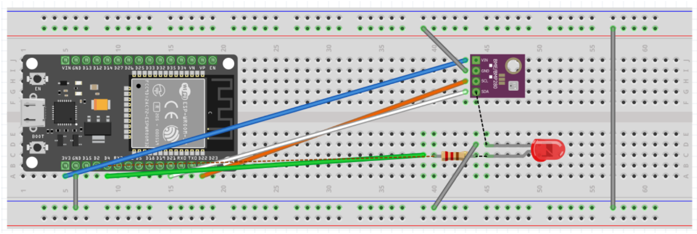

# ESP32 + Sensor BME280 + Node-RED (MQTT)

Este proyecto integra un **ESP32**, el sensor **BME280** y **Node-RED** utilizando el protocolo **MQTT**.  
Incluye dos programas independientes: uno para la **lectura y envío de datos del sensor** y otro para el **control de un LED desde Node-RED**.  

## 📌 Descripción

1. **Publicación de datos**  
   El ESP32 recoge la temperatura, humedad y presión atmosférica del sensor BME280 y publica los datos en el tópico `canal1`.  
   En Node-RED, los datos se representan mediante *gauges* y *charts* para su monitoreo en tiempo real.  

2. **Control del LED**  
   El ESP32 se suscribe al tópico `canal2`, permitiendo a Node-RED encender o apagar un LED conectado a la placa.  
   Esta funcionalidad permite demostrar el **control remoto de dispositivos** desde el dashboard.  

## 🚀 Ejecución

1. Instalar las librerías necesarias en Arduino IDE:  
   - `Adafruit BME280`  
   - `Adafruit BusIO`  
   - `Adafruit Unified Sensor`  

2. Configurar las credenciales WiFi y el broker MQTT en el código antes de cargarlo al ESP32.  

3. Subir los códigos de forma independiente según el objetivo:  
   - **`sensor_bme280_mqtt.ino`** → conexión y envío de datos.  
   - **`led_control_mqtt.ino`** → control del LED desde Node-RED.  

4. Importar el flujo de Node-RED incluido en el repositorio para visualizar datos y controlar el LED.  

## 🖼️ Diagramas y Flujos

- **Esquema en Fritzing**  
  
  

- **Dashboard en Node-RED**  
  

## 🎥 Demostración en video

[Ver en Google Drive](https://drive.google.com/file/d/1bVdxrej26ZMnXoOso6rz8y6qk1RVV_0Z/view?usp=sharing)

## 📂 Estructura del repositorio

